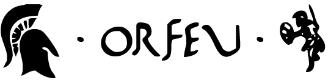

  

  <h3 align="center" dir="center">Orfeu</h3>

  

    Orfeu é uma framework UI desenvolvida para funcionar em aplicações Angular com o melhor desempenho.
     
  

 

## REFERÊNCIA

- [Padrão](#build)
- [Scripts](#scripts)
- [Estrutura de pastas](#estrutura-de-pastas)
- [Detalhes](#detalhes)

## PADRÃO

O orfeu é uma framework que recebe varias heranças. Extraimos a parte de interface do bootstrap e a parte funcional de alguns componentes do material design. Com isso o padrão portugues nunca poderia ser usado como padrão para nossa lib. 

Dessa forma aqui temos uma exeção que não deverá se repetir nas proximas libs ou aplicações.

0 - Esse projeto codificado em ingles(somente comentarios em portugues¹). 

¹ Alguns arquivos receberam pouca alteração quando trouxemos para dentro do orfeu, dessa forma alguns comentarios estão em ingles também, precisamos traduzilos.

1 - Estrutura de pastas do orfeu são diferentes já que aqui não temos uma aplicação e sim uma lib. Alguns motivos fazem com que esse padrão seja diferente.
Quando criamos um componente aqui como lib criamos também um modulo para ele ser importado de forma individual sem depender de outros modulos dos orfeu, assim uma tela pode usar um componente unico sem pesar o modulo carregando com varias coisas que não serão usadas.

Dessa forma nossas pastas dentro de lib continuam divindo componentes, porem dentro dessas pastas não temos varias sub-pastas. Os arquivos do componente ficam na raiz. Junto com o md nomeado de README.md, seguindo de um arquivo de export com nome de index.ts onde é exportado todo o componente.

## SCRIPTS

Para builder você pode usar direto o cli do angular: `ng build orfeu` pode também rodar com a flag `--prod`.

Scripts para teste e rotinas DevOps ainda não foram escritas.

## Estrutura de pastas

    .
    ├── src                    # Arquivos da nossa lib 
    │   ├── lib                # Nossos componentes que possuem typescript.
    │   ├── theme              # Nossos componentes que precisam apenas de classes css.
    │   ├── index.ts           # Arquivo de exportação dos componentes.

## PACOTES

| @apollus/        | Criador                                                | Docs         |
|------------------|--------------------------------------------------------|--------------|
| BUTTON           | Thiago.                                                |   [Doc][0]   |
| COMMON           | Precisa de contribuidores.                             |   [Doc][1]   |
| CHECKBOX         | Precisa de contribuidores.                             |   [Doc][12]   |
| CORE             | Precisa de contribuidores.                             |   [Doc][2]   |
| DIALOG           | Precisa de contribuidores.                             |   [Doc][3]   |
| INPUT            | Precisa de contribuidores.                             |   [Doc][4]   |
| PAGINATOR        | Precisa de contribuidores.                             |   [Doc][5]   |
| RADIO            | Precisa de contribuidores.                             |   [Doc][6]   |
| SORT             | Precisa de contribuidores.                             |   [Doc][7]   |
| TABLE            | Precisa de contribuidores.                             |   [Doc][8]   |
| TABS             | Precisa de contribuidores.                             |   [Doc][9]   |
| TOOLTIP          | Precisa de contribuidores.                             |   [Doc][10]  |
|------------------|--------------------------------------------------------|--------------|
| THEME            | Precisa de contribuidores.                             |   [Doc][11]  |

## Detalhes

- Tudo nesse diretório faz parte da lib orfeu de uso compartilhado.

[0]: https://desenvolvimento-server.apollusehs.com.br/apollus/apollus-ngx/tree/master/libs/orfeu/src/lib/button/README.md
[1]: https://desenvolvimento-server.apollusehs.com.br/apollus/apollus-ngx/tree/master/libs/orfeu/src/lib/common/README.md
[2]: https://desenvolvimento-server.apollusehs.com.br/apollus/apollus-ngx/tree/master/libs/orfeu/src/lib/core/README.md
[3]: https://desenvolvimento-server.apollusehs.com.br/apollus/apollus-ngx/tree/master/libs/orfeu/src/lib/dialog/README.md
[4]: https://desenvolvimento-server.apollusehs.com.br/apollus/apollus-ngx/tree/master/libs/orfeu/src/lib/input/README.md
[5]: https://desenvolvimento-server.apollusehs.com.br/apollus/apollus-ngx/tree/master/libs/orfeu/src/lib/paginator/README.md
[6]: https://desenvolvimento-server.apollusehs.com.br/apollus/apollus-ngx/tree/master/libs/orfeu/src/lib/radio/README.md
[7]: https://desenvolvimento-server.apollusehs.com.br/apollus/apollus-ngx/tree/master/libs/orfeu/src/lib/sort/README.md
[8]: https://desenvolvimento-server.apollusehs.com.br/apollus/apollus-ngx/tree/master/libs/orfeu/src/lib/table/README.md
[9]: https://desenvolvimento-server.apollusehs.com.br/apollus/apollus-ngx/tree/master/libs/orfeu/src/lib/tabs/README.md
[10]: https://desenvolvimento-server.apollusehs.com.br/apollus/apollus-ngx/tree/master/libs/orfeu/src/lib/tooltip/README.md
[11]: https://desenvolvimento-server.apollusehs.com.br/apollus/apollus-ngx/tree/master/libs/orfeu/src/theme/README.md
[12]: https://desenvolvimento-server.apollusehs.com.br/apollus/apollus-ngx/tree/master/libs/orfeu/src/lib/checkbox/README.md
